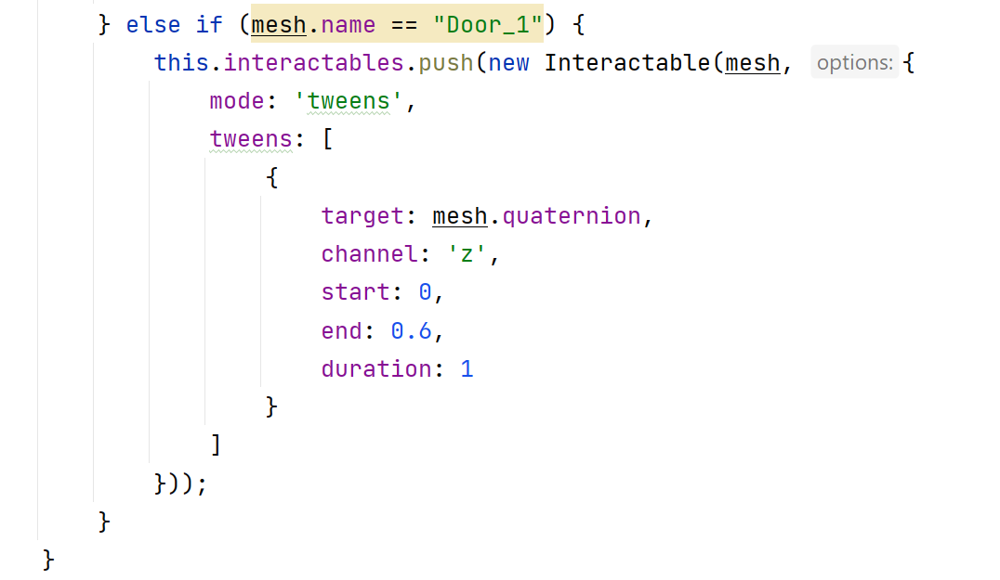
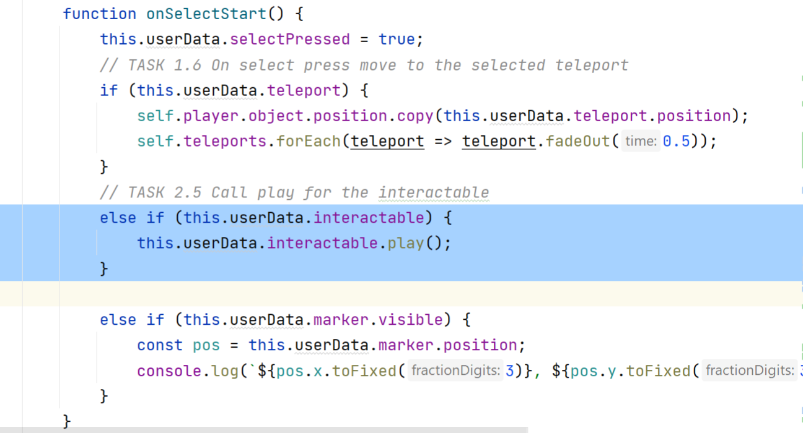
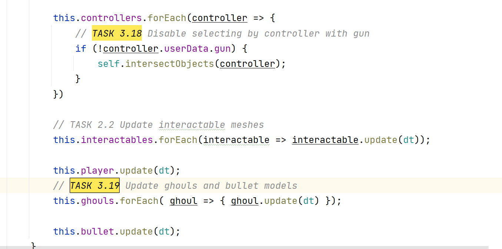

# VR Game

## Task 1. Movement by teleporting

### Task 1.1 Create teleports and add them to the scene


### Task 1.2 Display teleports when squeeze button is pressed


### Task 1.3 Hide teleports when squeeze button is released


### Task 1.4 Redraw teleports with update method


### Task 1.5 Define if controller pointing on teleport

#### Task 1.5.1 Add teleports cylinders to the collisionObjects 


#### Task 1.5.2 Highlight and store intersected teleport


#### Task 1.6 On select press move to the selected teleport


## Task 2. Interacting with meshes
- In the render loop, call update for each interactable mesh.
- Add meshes to the list of collisionObjects for selecting them by the controllers.
- Update the intersectObjects method to add the interactable to the controller's userData object.
- Update the onSelectStart function to handle the interactable.

### Task 2.1 Store and configure interactable meshes
#### Task 2.1.1 Create empty array for storing interacting meshes


#### Task 2.1.2 Check if mesh is interacting


#### Task 2.1.3 Store if object is interacting meshes



#### Task 2.2 Update interactable meshes


#### Task 2.3 Add meshes to the list of collisionObjects for selecting them by the controllers.


#### Task 2.4 Add the selected interactable to the controller's userData object.


#### Task 2.5 Call play for the interactable



## Task 3. Using a controller as a weapon

Useful link: [Link pathfinding](https://three-pathfinding.donmccurdy.com/)

- Load gun with collider mesh and bullet
- Use collider mesh to pick up the gun

### Task 3.1 Install library
```
npm install --save three-pathfinding
```

### Task 3.2 Link GLB-files with ghoul and gun models
### Task 3.3 Link MP3-files with sound effects

### Task 3.4 Configure debug options
```aidl
        // TASK 3.4 Configure debug options
        this.debug = {showPath: false, teleport: true};
```
### Task 3.5 Create empty array for markables models
```aidl
        // TASK 3.5 Create empty array for markables models
        this.markables = [];
```
### Task 3.6 Store markable mesh (chest)


### Task 3.7 Load all assets

### Task 3.8 Load ghoul, gun models and sound effects
```javascript
    loadGhoul() {
        const loader = getGltfLoader()

        const self = this;

        const anims = [
            {start: 81, end: 161, name: "idle", loop: true},
            {start: 250, end: 290, name: "block", loop: false},
            {start: 300, end: 320, name: "gethit", loop: false},
            {start: 340, end: 375, name: "die", loop: false},
            {start: 380, end: 430, name: "attack", loop: false},
            {start: 470, end: 500, name: "walk", loop: true},
            {start: 540, end: 560, name: "run", loop: true}
        ];

        // Load a GLTF resource
        loader.load(
            // resource URL
            ghoulModel,
            // called when the resource is loaded
            function (gltf) {
                const gltfs = [gltf];
                for (let i = 0; i < 3; i++) gltfs.push(cloneGLTF(gltf));

                self.ghouls = [];

                gltfs.forEach(function (gltf) {
                    const object = gltf.scene.children[0];

                    object.traverse(function (child) {
                        if (child.isMesh) {
                            child.castShadow = true;
                        }
                    });

                    const options = {
                        object: object,
                        speed: 0.8,
                        assetsPath: self.assetsPath,
                        loader: loader,
                        anims: anims,
                        clip: gltf.animations[0],
                        app: self,
                        name: 'ghoul',
                        npc: true
                    };

                    const ghoul = new Player(options);

                    const scale = 0.01;
                    ghoul.object.scale.set(scale, scale, scale);

                    ghoul.object.position.copy(self.randomWaypoint);
                    ghoul.newPath(self.randomWaypoint);

                    self.ghouls.push(ghoul);

                });

                self.loadGun();
            },
            // called while loading is progressing
            function (xhr) {

                self.loadingBar.progress = (xhr.loaded / xhr.total) * 0.33 + 0.33;

            },
            // called when loading has errors
            function (error) {

                console.error(error.message);

            }
        );
    }

    loadGun() {
        const loader = getGltfLoader()
        const self = this;

        // Load a GLTF resource
        loader.load(
            // resource URL
            gunModel,
            // called when the resource is loaded
            function (gltf) {
                self.gun = gltf.scene;
                self.gun.position.set(-0.430, 0.877, 3.013);
                self.gun.rotateX(Math.PI / 2);
                self.scene.add(self.gun);

                const bullet = gltf.scene.getObjectByName("Bullet");
                self.scene.add(bullet);

                const targets = [];
                self.ghouls.forEach(ghoul => targets.push(ghoul.object.children[1]));

                self.bullet = new Bullet(bullet, {
                    gun: self.gun,
                    targets
                });

                self.bullet.addEventListener('hit', ev => {
                    const tmp = self.ghouls.filter(ghoul =>
                        ev.hitObject == ghoul.object.children[1]);
                    if (tmp.length > 0) {
                        self.sounds.snarl.play();
                        const ghoul = tmp[0];
                        ghoul.action = 'die';
                        ghoul.dead = true;
                        ghoul.calculatedPath = null;
                        ghoul.curAction.loop = THREE.LoopOnce;
                        ghoul.curAction.clampWhenFinished = true;
                        ghoul.mixer.addEventListener('finished', (e) => {
                            self.scene.remove(ghoul.object);
                            self.ghouls.splice(self.ghouls.indexOf(ghoul), 1);
                        });
                    }
                });

                self.initGame();
            },
            // called while loading is progressing
            function (xhr) {

                self.loadingBar.progress = (xhr.loaded / xhr.total) * 0.33 + 0.66;

            },
            // called when loading has errors
            function (error) {

                console.error(error.message);

            }
        );
    }

    loadAudio() {

        if (this.audioListener === undefined) {
            this.audioListener = new THREE.AudioListener();
            // add the listener to the camera
            this.camera.add(this.audioListener);
            this.sounds = {};

            this.audio = {
                index: 0,
                names: Object.keys(soundFiles)
            }
        }

        const name = this.audio.names[this.audio.index];

        const loader = new THREE.AudioLoader();
        const self = this;

        // load a resource
        loader.load(
            // resource URL
            soundFiles[name],

            // onLoad callback
            function (audioBuffer) {
                // set the audio object buffer to the loaded object
                let snd;
                if (name === 'snarl') {
                    snd = new THREE.PositionalAudio(self.audioListener);
                } else {
                    snd = new THREE.Audio(self.audioListener);
                    self.scene.add(snd);
                    if (name === 'ambient') {
                        snd.setLoop(true);
                        snd.setVolume(0.5);
                    }
                }
                snd.setBuffer(audioBuffer);

                // play the audio
                if (name === 'ambient') snd.play();

                self.sounds[name] = snd;

                self.audio.index++;

                if (self.audio.index < self.audio.names.length) {
                    self.loadAudio();
                }
            },

            // onProgress callback
            function (xhr) {
                const peraudio = 0.25 / self.audio.length;
                self.loadingBar.progress = ((xhr.loaded / xhr.total) + self.audio.index) * peraudio + 0.75;
            },

            // onError callback
            function (err) {
                console.log('An error happened');
            }
        );
    }
```
### Task 3.9 Init path finding
```javascript
    get randomWaypoint() {
        const index = Math.floor(Math.random() * this.waypoints.length);
        return this.waypoints[index];
    }

    initPathfinding() {
        this.waypoints = [
            new THREE.Vector3(8.689, 2.687, 0.349),
            new THREE.Vector3(0.552, 2.589, -2.122),
            new THREE.Vector3(-7.722, 2.630, 0.298),
            new THREE.Vector3(2.238, 2.728, 7.050),
            new THREE.Vector3(2.318, 2.699, 6.957),
            new THREE.Vector3(-1.837, 0.111, 1.782)
        ];
        this.pathfinder = new Pathfinding();
        this.ZONE = 'dungeon';
        this.pathfinder.setZoneData(this.ZONE, Pathfinding.createZone(this.navmesh.geometry));
    }
```
### Task 3.10 Store grip model to the controller

### Task 3.11 Shout if controller is with the gun model
### Task 3.12 Add teleportation sound

### Task 3.13 Load audio after entering VR mode

### Task 3.14 Add chest and gun collider to collision objects 

### Task 3.15 Change controller model
```
    // TASK 3.15 Change controller model
    pickupGun(controller = this.controllers[0]) {
        this.gun.position.set(0, 0, 0);
        this.gun.quaternion.identity();
        //this.gun.rotateY( -Math.PI/2 )
        controller.children[0].visible = false;
        controller.add(this.gun);
        controller.userData.gun = true;
        const grip = controller.userData.grip;
        this.dolly.remove(grip);
    }
```
### Task 3.16 Change controller model
### Task 3.17 Change controller model


### Task 3.18 Disable selecting by controller with gun
### Task 3.19 Update ghouls and bullet models


## Task 4. Advanced

#### Task 4.1 Take gun only when chest is open

#### Task 4.2 Add you own monster

### Task 4.3 Allow multiple bullets

#### Resources

Models:
- https://kenney.nl/assets?q=3d
- https://quaternius.com
- https://www.cgtrader.com/
- https://www.turbosquid.com/
- https://free3d.com/3d-models/
- https://www.mixamo.com/

Audio:
- https://mixkit.co/free-sound-effects/game/
- https://elements.envato.com/sound-effects

